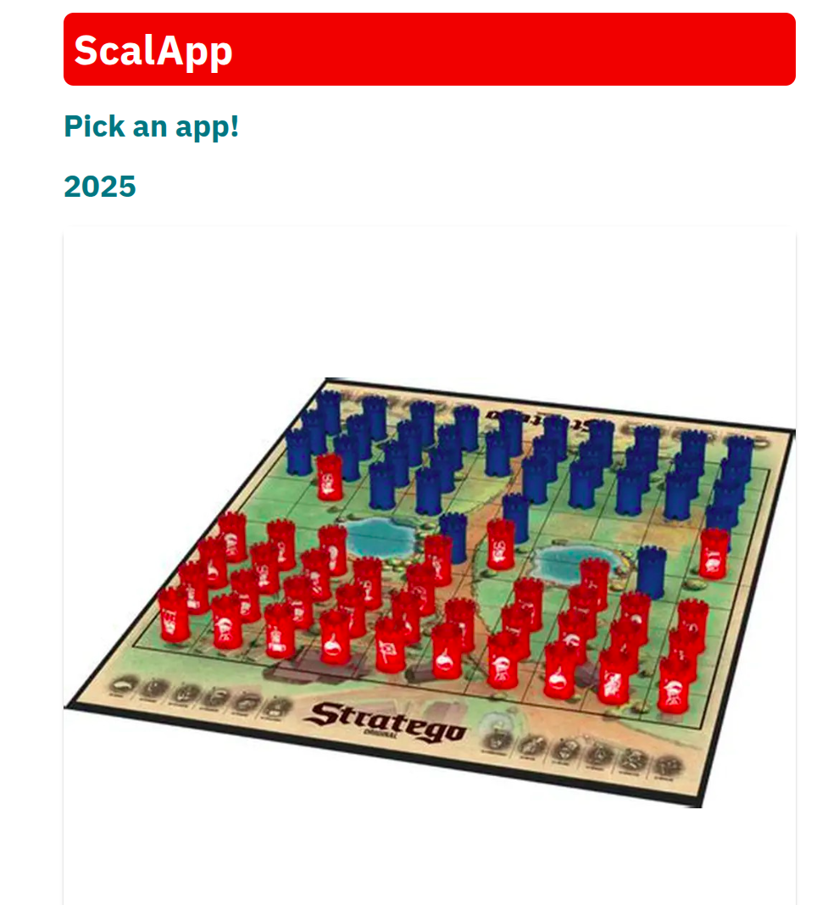
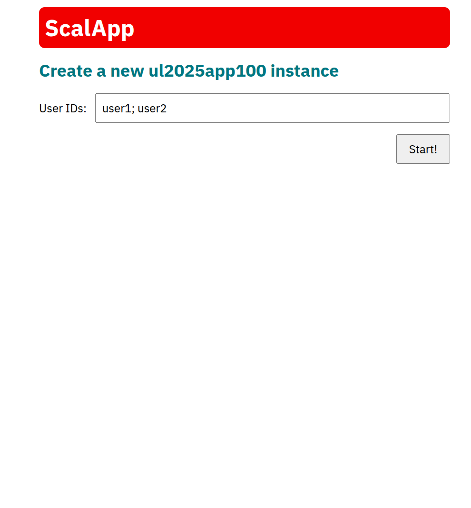
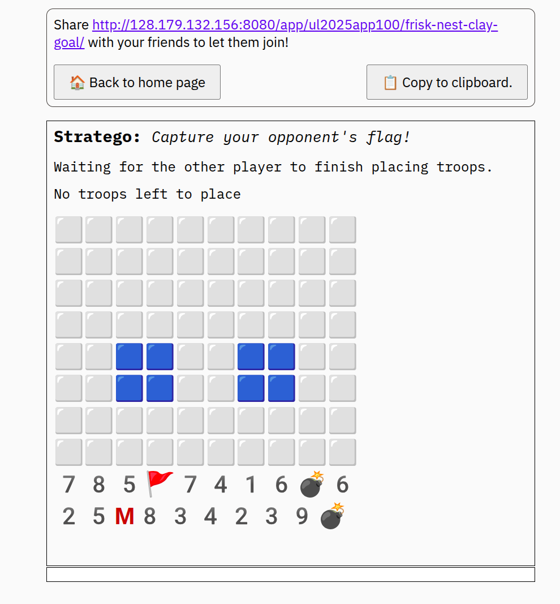

# Stratego Web App 🎯

A fully functional multiplayer **Stratego** board game implemented as a web application, built for the EPFL CS-214 Software Construction course (Fall 2025).

The app runs a Scala backend server with a Scala.js frontend compiled to JavaScript, communicating over WebSockets. Two players connect to the same game room from their browsers, secretly place their troops, then take turns moving and attacking according to official Stratego rules — with fog of war, combat resolution, and win detection all handled server-side.

## Screenshots

**Welcome page — select Stratego to create a new game room**


**Game room creation — enter two player IDs to start**


**Placement phase — place your troops secretly on your half of the board**


## Features

- **Full Stratego rule implementation** — all 12 troop types with correct rank hierarchy, special rules for Spy, Miner, Bomb and Scout
- **Secret troop placement phase** — each player places their 20 troops randomly shuffled on their half of the board before the game begins
- **Fog of war** — opponent's pieces are hidden (shown as 🟥) until revealed in combat
- **Combat resolution** — server-side battle logic handles all special cases: Spy kills Marshal, Miner defuses Bomb, equal ranks both die
- **Scout movement** — Scouts can move any number of squares in a straight line, blocked by pieces and lakes
- **Lakes** — four 2×2 impassable lake zones in standard Stratego positions
- **Legal move highlighting** — clicking a piece highlights all valid destinations in yellow
- **Turn enforcement** — server rejects moves from the wrong player
- **Win detection** — game ends immediately when a player's Flag is captured
- **Shareable room link** — the framework generates a unique room URL to send to your opponent
- **Multiplayer over LAN/WiFi** — two players on the same network can play in real time via browser
- **Emoji-based board rendering** — pieces rendered with emoji icons (💣 Bomb, 🚩 Flag, M Marshal, rank numbers for others)

## Architecture

The project follows a clean **client-server architecture** with a strict separation between game logic, view projection and UI rendering:

**Server side (Scala JVM)**
- `Logic` — the core `StateMachine` implementation; handles `init`, `transition` and `project`
  - `init` — creates a new game state with 40 shuffled troops (20 per player) ready for placement
  - `transition` — validates and applies `Event.SquareClicked` events; enforces turn order and phase rules; delegates to `GameLogic`
  - `project` — converts the full internal `State` to a per-player `View`, hiding opponent pieces and computing legal move highlights via `ViewLogic`
- `GameLogic` — pure, stateless game mechanics:
  - Board creation and troop initialization (`initTroops`, `emptyBoard`)
  - Movement validation including Scout multi-square movement and lake avoidance (`canReach`, `isLegalMove`, `isLegalAttack`, `legalDestinations`)
  - Combat resolution with all Stratego special cases (`resolveCombat`)
  - Click handling for placement and attack phases (`handleClick`)
  - Win condition detection (`checkGameOver`)
- `ViewLogic` — projects internal `State` to a per-player `StateView`, applying fog of war (hiding unrevealed enemy pieces as `TroopView.Covered`)
- `State` — immutable case class holding: board, selected square, dead troops, turn order, placement queues, current phase
- `Wire` — JSON serialization/deserialization of all `Event` and `View` types using `ujson`, shared between server and client

**Client side (Scala.js → JavaScript)**
- `TextUI` — the browser-side entry point, compiled to JavaScript via Scala.js
- `TextUIInstance` — handles rendering and user input:
  - `renderView` — renders the full board as a grid of clickable emoji squares
  - `renderBoard` — maps each `SquareView` to a styled `TextSegment` with click handlers
  - `renderSquare` — applies selection highlighting, legal move highlighting, fog of war styling and emoji icons per piece type
  - `renderSubHeaderPlacing` / `renderSubHeaderPlaying` — contextual status messages per phase and player

**Shared types**
- `Coord`, `Troop`, `Square`, `Event`, `State`, `View`, `StateView`, `PhaseView`, `TroopView`, `SquareView`, `BoardConstants` — all defined once and used on both sides

## How the Game Works

### Placement Phase
Both players are each assigned 20 randomly shuffled troops. They take turns clicking squares on their half of the board (bottom 2 rows for player 1, top 2 rows for player 2) to place troops one at a time. Once both players have placed all 20 troops the game moves automatically to the attack phase.

### Attack Phase
Players alternate turns. On your turn:
1. Click one of your movable troops to select it — legal destinations highlight in yellow
2. Click a highlighted square to move there, or click an enemy piece to attack

**Combat:** when two pieces meet, the server resolves the fight:
- Higher rank wins; both die on equal ranks
- **Spy** (rank 1) kills the **Marshal** (rank 10) when attacking
- **Miner** (rank 3) is the only piece that can defuse a **Bomb** (rank 11)
- **Scouts** (rank 2) can move any number of squares in a straight line
- **Bombs** and **Flags** cannot move

**Win condition:** the game ends immediately when a player's Flag is captured.

## Troop Reference

| Troop | Rank | Count | Special Rule |
|-------|------|-------|--------------|
| Marshal | 10 | 1 | Loses to Spy |
| General | 9 | 1 | — |
| Colonel | 8 | 2 | — |
| Major | 7 | 2 | — |
| Captain | 6 | 2 | — |
| Lieutenant | 5 | 2 | — |
| Sergeant | 4 | 2 | — |
| Miner | 3 | 2 | Defuses Bombs |
| Scout | 2 | 2 | Moves any distance in straight line |
| Spy | 1 | 1 | Kills Marshal when attacking |
| Bomb | 11 | 2 | Immovable; kills all except Miner |
| Flag | 0 | 1 | Immovable; capturing it wins the game |

## Tech Stack

- **Scala 3** — backend game logic and state machine
- **Scala.js** — frontend compiled to JavaScript, runs in the browser
- **WebSockets** — real-time bidirectional communication between server and clients
- **ujson** — JSON serialization for the wire protocol
- **sbt** — build tool
- **cs214 webapp framework** — EPFL course framework providing the WebSocket server, client rendering primitives and app lifecycle management

## Getting Started

### Prerequisites
- Java JDK 11 or higher
- sbt ([install from scala-sbt.org](https://www.scala-sbt.org/download.html))

### Running locally

1. Clone the repository:
```bash
git clone https://github.com/perdikeas/scala-stratego-webapp.git
cd scala-stratego-webapp
```

2. Start the server:
```bash
sbt run
```

3. Open your browser and go to:
```
http://localhost:8080
```

4. Select **Stratego** from the welcome page, enter two player IDs and click **Start!**

5. Share the generated room URL with your opponent — they must be on the same WiFi/LAN network

### Running tests

```bash
sbt test
```

The test suite covers: initialization, placement validation, movement rules, Scout multi-square movement, all combat special cases, turn enforcement and win detection.

## Project Structure

```
apps/ul2025app100/
├── jvm/src/main/scala/apps/ul2025app100/
│   ├── Logic.scala          # StateMachine entry point (init, transition, project)
│   ├── GameLogic.scala      # Pure game mechanics (movement, combat, click handling)
│   ├── ViewLogic.scala      # State → per-player View projection (fog of war)
│   ├── State.scala          # State, Coord, Troop, Square, Phase, View types
│   ├── Wire.scala           # JSON serialization for Event and View
│   └── MainJVM.scala        # Server entry point
├── js/src/main/scala/apps/ul2025app100/
│   ├── TextUI.scala         # Scala.js client entry point
│   └── MainJS.scala         # Client bootstrap
└── shared/src/main/scala/apps/ul2025app100/
    └── SharedTypes.scala    # Types shared between server and client
```

## Authors

- Konstantinos Perdikeas
- Panagiotis Efthimios Valavanis
- Antoine Ghaoui

EPFL — CS-214 Software Construction, Fall 2025

## License
MIT